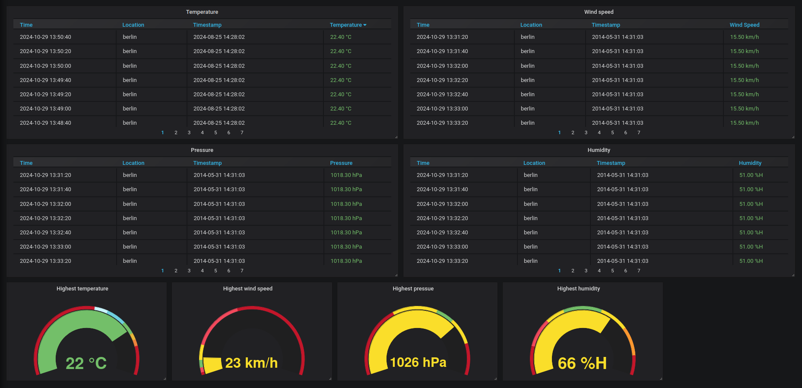
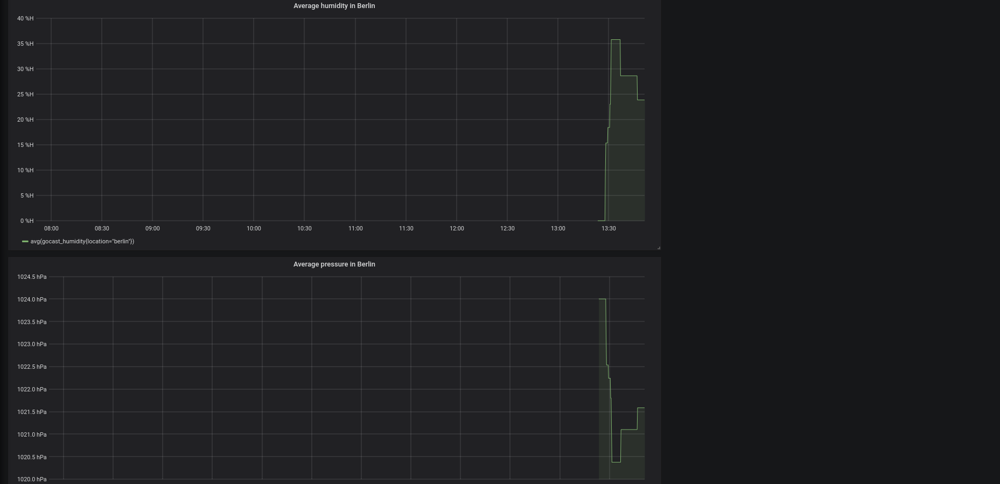
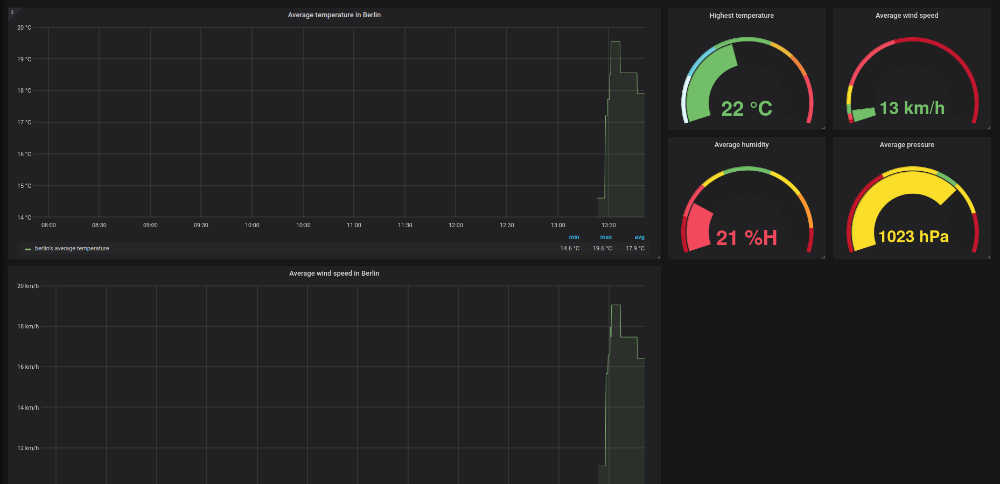

# Gocast
Gocast is an application for the weather, written in golang. You can use query to get weather-data.

|command line|environment|default|description|
|-|-|-|-|
|make run2|-|-|Start the application|
|go run main.go|--weather-api-url --weather-geo-url --geo-api-key --req-aft-min --fdb-user --fdb-password --fdb-database --fdb-address|-|Start the application|
|make startdb|-|-|Start the database|
|make stopdb|-|-|Stop the database|
|make run|-|-|Start the application the database|
|make stop|-|-|Stop the application & database|
---
### Grafana Dashboards


**Dashboard**

**Average Dashboard**



---
### How to run
To run the application you need to start the database first, for that you can use `make startdb`, then you need to use `go run main.go` or `make run2` to start the application.
To stop the application you need to close it with `CTRL+C`. Afterwards you can also close the database using `make stopdb`.

You can run the application with `make run` or `docker-compose up`.
If you want to Pause it you can use `CTRL+C`. When you want to completely stop the application you need to close it with `make stop` or `docker-compose down`.

### Example usages
```bash
curl "http://localhost:8080/direct?date=2024-08-25&city=Berlin"

curl "http://localhost:8080/direct?date=2010-12-10&city=Hamburg"

curl "http://localhost:8080/direct?date=2014-05-31&city=Berlin"
```

### Examples of how not to use it
```bash
curl "http://localhost:8080/direct?date=2024-08-25&city=Berlin"

<!-- curl "http://localhost:8080/?date=&city=Berlin" -->

curl "http://localhost:8080/direct?date=2024-08-25"

curl "http://localhost:8080/direct"
```
You receive data in the .json format.